# CredPal FX Trading API - System Design Document

## Table of Contents

1. [Architecture Overview](#architecture-overview)
2. [Database Design](#database-design)
3. [Authentication Flow](#authentication-flow)
4. [Wallet Design](#wallet-design)
5. [FX Rate Strategy](#fx-rate-strategy)
6. [Trading Flows](#trading-flows)
7. [Concurrency Control](#concurrency-control)
8. [Idempotency Design](#idempotency-design)
9. [Error Handling](#error-handling)
10. [Security Considerations](#security-considerations)
11. [Scalability Considerations](#scalability-considerations)
12. [Final Notes](#final-notes)

---

## 1. Architecture Overview

The system follows **Clean Architecture** combined with **Domain-Driven Design (DDD)** and **Hexagonal Architecture** (Ports & Adapters). This provides clear separation of concerns, testability, and the ability to swap infrastructure without affecting business logic.

### Layer Structure

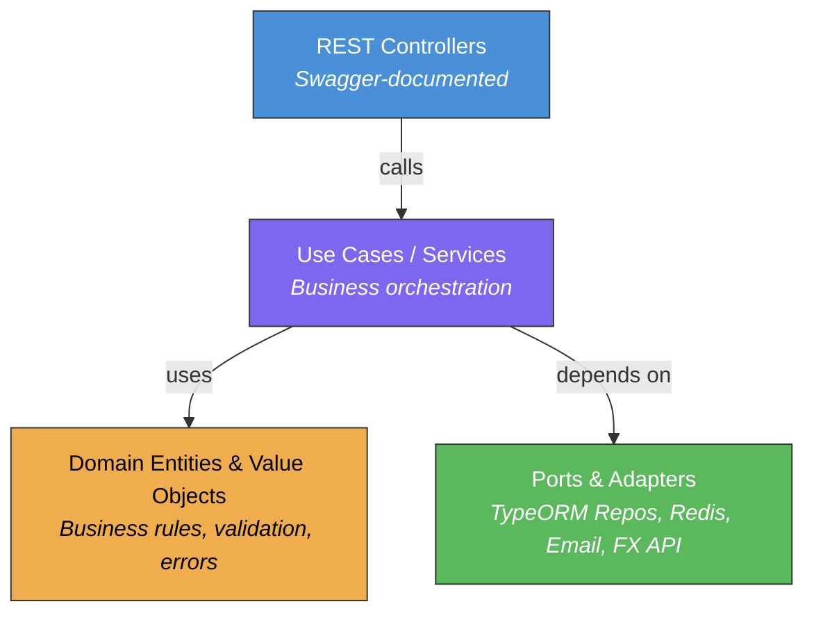

### Module Structure

Each feature module follows the same internal structure:

```
module/
  module.ts                         # NestJS module definition
  internal/
    domain/                         # Pure business logic (no framework deps)
      entities/                     # Domain entities with static create()
      value-objects/                # Immutable value objects with validation
      errors/                       # Domain-specific error classes
      enums/                        # Business enumerations
      types/                        # TypeScript interfaces for domain
    application/                    # Use case orchestration
      services/                     # Application services
      use-cases/                    # Single-responsibility use cases
      ports/                        # Interfaces (contracts for adapters)
    infrastructure/                 # Framework-specific implementations
      rest/controllers/             # REST endpoints + Swagger
      rest/dtos/                    # Request/response DTOs with validation
      repositories/                 # TypeORM repository implementations
      adapters/                     # External service adapters
```

### Core Module

A single `@Global() CoreModule` bundles all cross-cutting infrastructure:
- **Database**: TypeORM (PostgreSQL) + Redis (ioredis)
- **Authentication**: JWT via Passport
- **Notification**: LSP-based email/SMS adapters
- **Guards**: JWT, Roles, Throttler
- **Interceptors**: Idempotency, Logging
- **Filters**: Domain exception, HTTP exception

### Notification System (LSP)

The notification system applies the **Liskov Substitution Principle** — email and SMS adapters implement the same `INotificationService` interface. Any adapter can be swapped without changing consuming code:

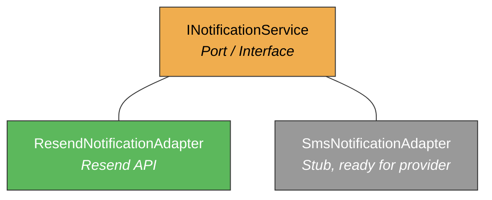

---

## 2. Database Design

### Entity-Relationship Diagram

```mermaid
erDiagram
    users ||--o{ otps : "has"
    users ||--|| wallets : "owns"
    wallets ||--o{ wallet_balances : "contains"
    wallet_balances ||--o{ ledger_entries : "tracks"
    users ||--o{ transactions : "performs"
    transactions ||--o{ ledger_entries : "generates"
    transactions }o--|| fx_rate_snapshots : "references"
    users ||--o{ idempotency_keys : "creates"

    users {
        uuid id PK
        varchar email UK
        varchar password_hash
        varchar first_name
        varchar last_name
        varchar role
        boolean is_email_verified
        boolean is_active
        timestamptz created_at
        timestamptz updated_at
    }

    otps {
        uuid id PK
        uuid user_id FK
        varchar code
        varchar type
        timestamptz expires_at
        boolean is_used
        timestamptz created_at
    }

    wallets {
        uuid id PK
        uuid user_id FK_UK
        varchar status
        timestamptz created_at
        timestamptz updated_at
    }

    wallet_balances {
        uuid id PK
        uuid wallet_id FK
        varchar currency
        decimal available_balance
        decimal held_balance
        timestamptz created_at
        timestamptz updated_at
    }

    ledger_entries {
        uuid id PK
        uuid wallet_balance_id FK
        uuid transaction_id FK
        varchar type
        decimal amount
        decimal balance_after
        varchar description
        timestamptz created_at
    }

    transactions {
        uuid id PK
        uuid user_id FK
        varchar idempotency_key UK
        varchar type
        varchar status
        varchar source_currency
        varchar target_currency
        decimal source_amount
        decimal target_amount
        decimal exchange_rate
        uuid exchange_rate_id FK
        decimal fee
        jsonb metadata
        timestamptz completed_at
        timestamptz created_at
        timestamptz updated_at
    }

    fx_rate_snapshots {
        uuid id PK
        varchar base_currency
        varchar target_currency
        decimal rate
        decimal inverse_rate
        varchar source
        timestamptz fetched_at
        timestamptz created_at
    }

    idempotency_keys {
        uuid id PK
        varchar key UK
        uuid user_id
        varchar endpoint
        varchar request_hash
        int response_status
        jsonb response_body
        varchar status
        timestamptz expires_at
        timestamptz created_at
        timestamptz updated_at
    }
```

### Schema Details (8 tables)

| Table | Purpose | Key Constraints |
|-------|---------|----------------|
| `users` | User accounts | email UNIQUE |
| `otps` | Email verification codes | FK user_id, expires_at for TTL |
| `wallets` | One wallet per user | user_id UNIQUE |
| `wallet_balances` | Currency balances per wallet | UNIQUE(wallet_id, currency) |
| `ledger_entries` | Append-only audit trail | FK wallet_balance_id, transaction_id |
| `transactions` | Business operations log | idempotency_key UNIQUE |
| `fx_rate_snapshots` | Historical rate audit | INDEX(base_currency, target_currency) |
| `idempotency_keys` | Duplicate request prevention | key UNIQUE, expires_at for cleanup |

### Money Precision

All monetary columns use `decimal(18,4)` — 18 total digits with 4 decimal places. This prevents floating-point rounding errors inherent to IEEE 754. Application-layer arithmetic uses the `decimal.js` library configured with 20-digit precision and ROUND_HALF_UP rounding.

Exchange rates use `decimal(18,8)` for higher precision in rate calculations.

---

## 3. Authentication Flow

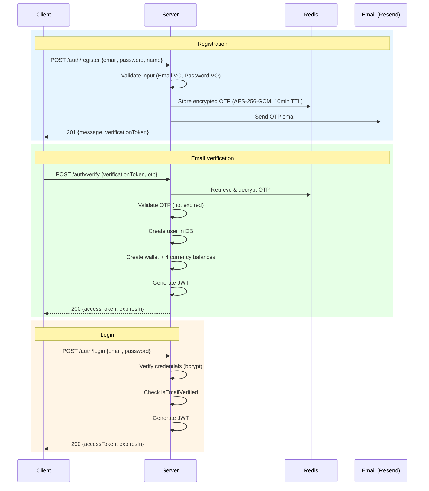

### OTP Design
- 6-digit numeric code generated via `crypto.randomInt()`
- 10-minute expiration
- Stored in database (not Redis) for audit trail
- Previous OTPs invalidated on resend

### JWT Design
- 1-hour expiration
- Payload: `{ sub: userId, email, role }`
- Extracted via Passport strategy + `@CurrentUser()` decorator

---

## 4. Wallet Design

### Balance + Ledger Hybrid Model

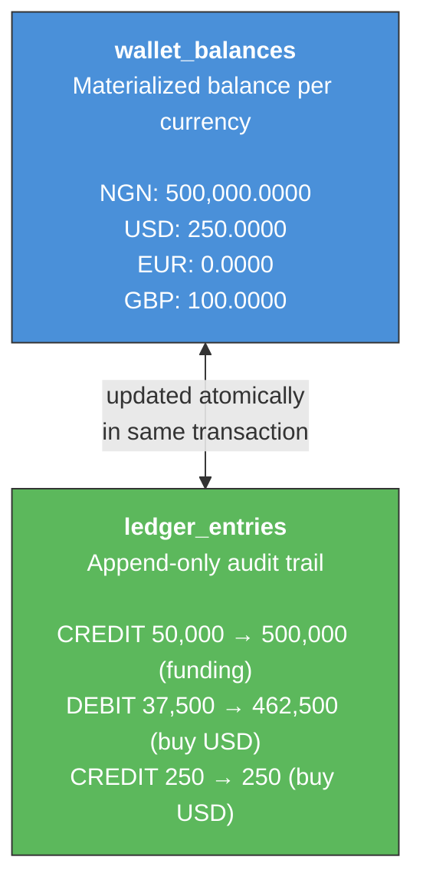

### Wallet Management Lifecycle

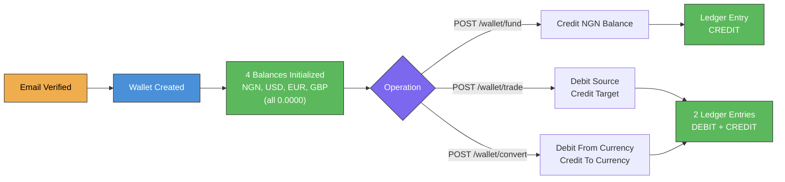

### Why Not Pure Ledger?

| Approach | Balance Read | Write | Audit |
|----------|-------------|-------|-------|
| Pure Ledger (SUM) | O(n) | O(1) | Full |
| **Balance + Ledger** | **O(1)** | **O(1)** | **Full** |
| Balance Only | O(1) | O(1) | None |

The hybrid model gives O(1) balance reads via `wallet_balances` while maintaining a complete audit trail via `ledger_entries`. Both are updated atomically in the same database transaction.

### Funding (NGN Only)

Users can only fund their wallet in NGN (Nigerian Naira). Foreign currencies (USD, EUR, GBP) are acquired exclusively through trading or conversion. This mirrors real-world FX workflows where users deposit local currency and purchase foreign currency.

---

## 5. FX Rate Strategy

### 3-Tier Fallback

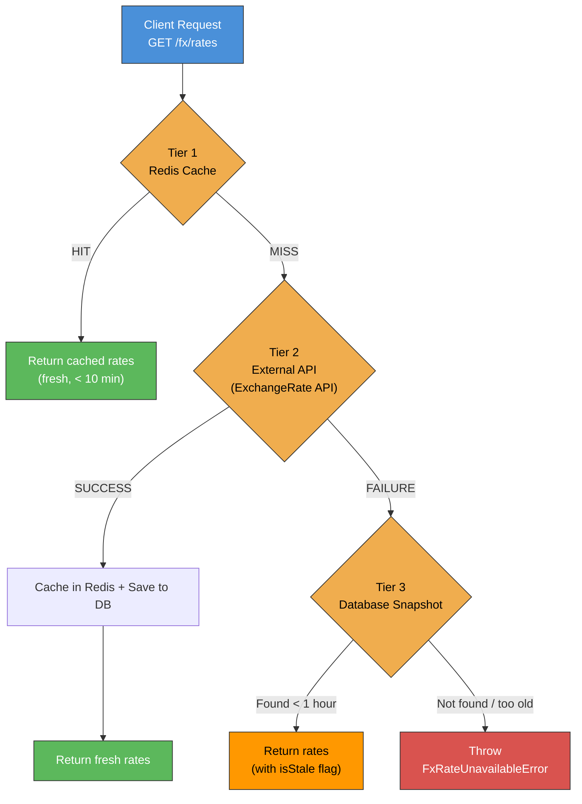

### Rate Staleness

| Age | Status | Trading Allowed? |
|-----|--------|-----------------|
| < 10 min | Fresh (from Redis) | Yes |
| 10-15 min | Fresh (from API/DB) | Yes |
| 15-60 min | **Stale** (flagged) | **No** (must refresh) |
| > 60 min | Expired | No (unavailable) |

Stale rates (> 15 minutes old) block trading operations to prevent users from executing trades at outdated prices. The `GET /fx/rates` response always includes `fetchedAt` and `isStale` fields so clients can inform users.

---

## 6. Trading Flows

### Trade (NGN ↔ Foreign Currency)

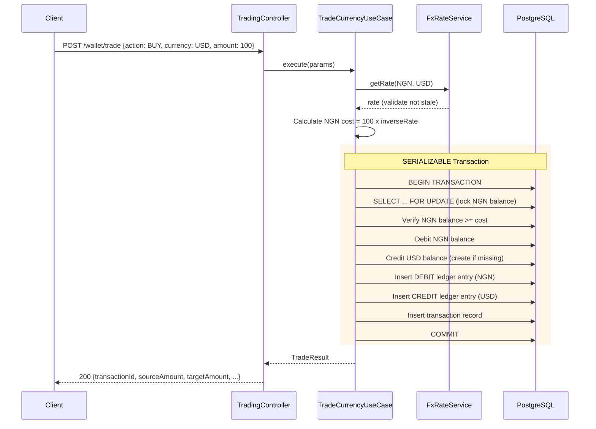

### Convert (Non-NGN ↔ Non-NGN)

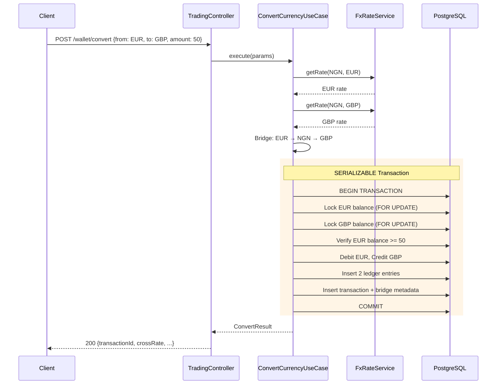

Note: The NGN balance is **not affected** during conversion — it's only used as a rate calculation bridge.

### Trading Decision Flow (BUY vs SELL)

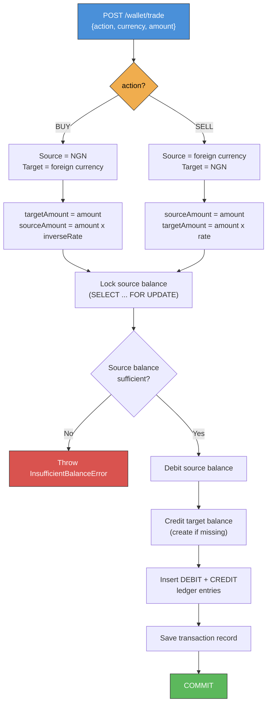

### Currency Exchange Bridge (Cross-Pair Conversion)

When converting between two non-NGN currencies (e.g. EUR → GBP), the system bridges through NGN as an intermediate calculation step:

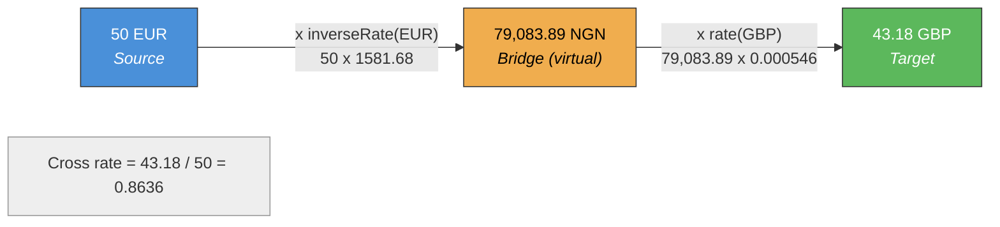

> The NGN amount is calculated but never debited or credited — it only serves as a common denominator for rate calculation.

### Transaction Audit Trail

Every trade and conversion stores rich metadata for complete auditability:

```json
{
  "action": "BUY",
  "exchangeRate": "0.00064516",
  "fetchedAt": "2024-01-15T10:30:00.000Z"
}
```

For conversions, bridge calculation details are included:

```json
{
  "bridgeCurrency": "NGN",
  "fromToNgnRate": "1550.0000",
  "ngnToToRate": "0.00056200",
  "crossRate": "0.87110000"
}
```

Transactions also reference the `fx_rate_snapshots.id` via the `exchange_rate_id` foreign key, enabling exact rate reproduction.

---

## 7. Concurrency Control

### Double-Spending Prevention

The system uses **pessimistic write locks** combined with **SERIALIZABLE transaction isolation** to prevent double-spending:

```sql
-- Step 1: Begin serializable transaction
BEGIN TRANSACTION ISOLATION LEVEL SERIALIZABLE;

-- Step 2: Lock the specific balance row
SELECT * FROM wallet_balances
WHERE wallet_id = $1 AND currency = $2
FOR UPDATE;

-- Step 3: Verify sufficient balance
-- Step 4: Update balance
-- Step 5: Insert ledger entry
-- Step 6: Commit
COMMIT;
```

**Why both pessimistic locks AND serializable isolation?**
- `SELECT ... FOR UPDATE` prevents concurrent reads of the same row
- `SERIALIZABLE` ensures the entire transaction sees a consistent snapshot
- Together they provide the strongest guarantee against race conditions

### Concurrent Trade Scenario

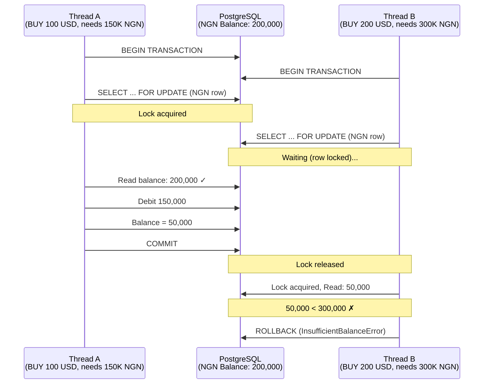

---

## 8. Idempotency Design

Financial endpoints (`/wallet/fund`, `/wallet/trade`, `/wallet/convert`) support idempotent requests via the `Idempotency-Key` header.

### Flow

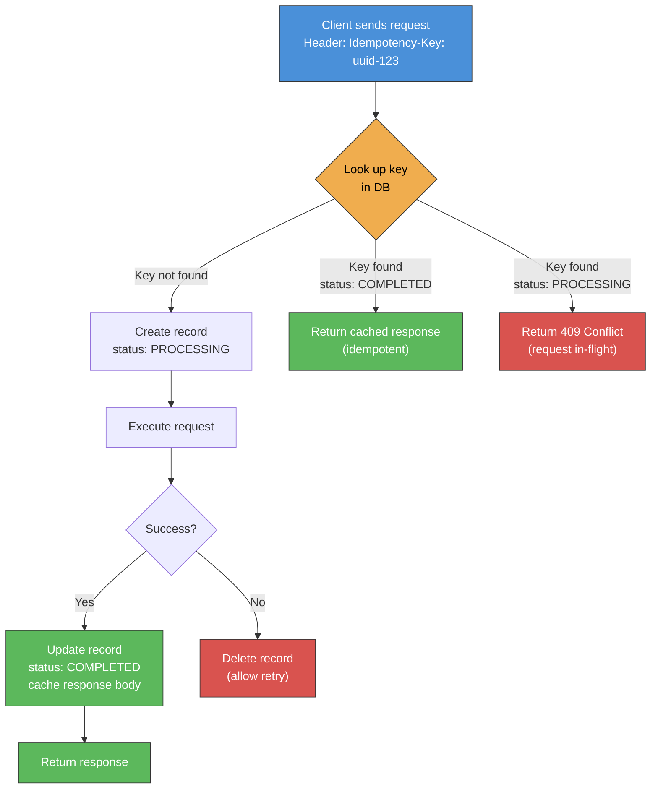

### Idempotency Key Lifecycle

| Status | Meaning |
|--------|---------|
| PROCESSING | Request in-flight, reject duplicate |
| COMPLETED | Response cached, return on retry |

Keys expire after 24 hours for automatic cleanup.

### Request Integrity

The idempotency system includes a **request hash** (SHA-256 of the request body). This ensures that if a client reuses the same idempotency key with a different payload, the conflict is detected and the previously cached response is not incorrectly returned.

---

## 9. Error Handling

### Domain Exceptions

Each domain error maps to a specific HTTP status and error code:

| Error | HTTP Status | Error Code |
|-------|-------------|------------|
| UserAlreadyExistsError | 409 | USER_ALREADY_EXISTS |
| InvalidCredentialsError | 401 | INVALID_CREDENTIALS |
| EmailNotVerifiedError | 403 | EMAIL_NOT_VERIFIED |
| InvalidOtpError | 400 | INVALID_OTP |
| WalletNotFoundError | 404 | WALLET_NOT_FOUND |
| InsufficientBalanceError | 400 | INSUFFICIENT_BALANCE |
| CurrencyNotSupportedError | 400 | CURRENCY_NOT_SUPPORTED |
| FxRateUnavailableError | 503 | FX_RATE_UNAVAILABLE |
| StaleRateError | 409 | STALE_RATE |
| SameCurrencyError | 400 | SAME_CURRENCY |

### Standardized Response Format

```json
{
  "statusCode": 400,
  "error": "INSUFFICIENT_BALANCE",
  "message": "Insufficient balance",
  "timestamp": "2024-01-15T10:30:00.000Z"
}
```

---

## 10. Security Considerations

| Concern | Solution |
|---------|----------|
| Authentication | JWT (1h expiry) via @nestjs/passport |
| Authorization | Role-based guard (@Roles decorator) |
| Password Storage | bcrypt with 12 salt rounds |
| Input Validation | class-validator (whitelist + forbidNonWhitelisted) |
| Rate Limiting | @nestjs/throttler (configurable per endpoint) |
| SQL Injection | TypeORM parameterized queries |
| Double-Spending | Pessimistic locks + SERIALIZABLE isolation |
| Replay Attacks | Idempotency-Key with DB persistence |
| Money Precision | decimal(18,4) + decimal.js (no floating point) |
| Stale Data | 15-min rate threshold blocks outdated trades |
| OTP Security | 6-digit crypto.randomInt(), 10-min expiry, one-time use |
| Idempotency Integrity | SHA-256 request hash prevents key reuse with different payloads |
| OTP Invalidation | Previous OTPs invalidated on resend (prevents parallel brute-force) |

---

## 11. Scalability Considerations

### Current Design Bottlenecks

1. **Single PostgreSQL instance**: All balance updates go through one DB
2. **Row-level locks**: High-volume trading on the same balance row creates contention
3. **Synchronous FX API calls**: External API latency affects trade execution

### Future Scaling Strategies

| Strategy | Benefit |
|----------|---------|
| Read replicas | Scale read queries (balances, transactions) |
| Connection pooling (PgBouncer) | Handle more concurrent connections |
| Redis cluster | Scale rate caching horizontally |
| Queue-based trades | Decouple trade execution from HTTP request |
| Sharding by user_id | Distribute balance rows across DB shards |
| Rate pre-fetching (cron) | Reduce external API calls |

### Monitoring Recommendations

- Transaction latency (P50, P95, P99)
- Lock wait times
- FX API failure rates and fallback activation
- Idempotency cache hit rate
- Balance reconciliation (ledger SUM vs materialized balance)

### Design Provisions for Future Features

| Provision | Current State | Future Use |
|-----------|--------------|------------|
| `held_balance` on `wallet_balances` | Always `0.0000` | Balance reservations / pending trades |
| `fee` on `transactions` | Always `0.0000` | Per-transaction fee charging |
| `PENDING`/`FAILED`/`REVERSED` statuses | Only `COMPLETED` used | Async trade workflows / refunds |
| `SmsNotificationAdapter` | Stub implementation | SMS-based OTP delivery |
| `ADMIN` user role | Defined in enum | Admin dashboard / user management |

---

## 12. Final Notes

### Scaling to Millions of Users

The current design prioritizes correctness. To handle millions of users, two scaling approaches apply:

**Vertical scaling** (bigger machines):
- Upgrade PostgreSQL to a larger instance with more CPU, RAM, and IOPS for higher transaction throughput.
- Increase Redis memory to hold more cached rates and idempotency keys.

**Horizontal scaling** (more machines):
- **Read replicas** — route balance and transaction queries to replicas; keep the primary for writes only.
- **Database sharding** — partition wallets by `user_id` so different users' trades hit different DB shards, reducing lock contention.
- **Connection pooling** — add PgBouncer to handle many concurrent connections efficiently.
- **Async trade processing** — accept trades into a queue (e.g. Bull/Redis), process in the background, and notify clients on completion.
- **Redis cluster** — distribute cached FX rates and idempotency keys across multiple Redis nodes.
- **Pre-fetch FX rates** — use a cron job instead of on-demand fetching to reduce external API dependency.

The ports & adapters architecture makes these changes possible without rewriting business logic — swap the infrastructure adapter, not the use case.

### Documented Assumptions

**FX Rates:**
- All FX rates use NGN as the base currency. Cross-currency pairs (e.g. EUR/GBP) are derived by bridging through NGN — no direct pair rates are fetched.
- Rates are sourced from a single provider (ExchangeRate API). There is no multi-provider aggregation or median-rate calculation.
- Rates older than 15 minutes are rejected for trade execution. This threshold balances freshness against API availability.
- The 3-tier cache (Redis → API → DB) prioritizes availability — if the external API is down, the system falls back to the last known DB snapshot rather than refusing all requests.
- Rate snapshots are persisted to the database for auditability. Every transaction references the exact rate used.

**Wallet Design:**
- Each user has exactly one wallet, auto-created upon email verification with four currency balances (NGN, USD, EUR, GBP) initialized to zero.
- NGN is the only fundable currency. Foreign currencies are acquired exclusively through trading or conversion — this mirrors real-world FX workflows.
- The balance + ledger hybrid model was chosen over pure ledger (SUM-based) for O(1) balance reads. Both are updated atomically in the same database transaction to prevent drift.
- `held_balance` exists on every balance row but is currently unused (`0.0000`). It's provisioned for future hold/reserve flows (e.g. pending trades, escrow).
- Wallet funding is simulated — there is no real payment gateway. The `/wallet/fund` endpoint directly credits the NGN balance.
- The `recipientWalletId` on SELL trades is accepted and stored in transaction metadata but not validated against any existing wallet. This simulates a sell-to-recipient flow without requiring a full recipient wallet lookup.

**General:**
- User creation is deferred until email verification. No unverified user records exist in the database — registration stores only an encrypted OTP in Redis.
- OTPs are 6-digit numeric codes with 10-minute expiry, encrypted at rest with AES-256-GCM.
- All monetary arithmetic uses `decimal.js` (20-digit precision, ROUND_HALF_UP) to avoid IEEE 754 floating-point errors. Database columns use `decimal(18,4)` for money and `decimal(18,8)` for exchange rates.
- The API is stateless — JWT tokens carry the user identity. No server-side session storage.
- Rate limiting is global at 100 requests per 60 seconds. No per-endpoint differentiation is currently configured.
